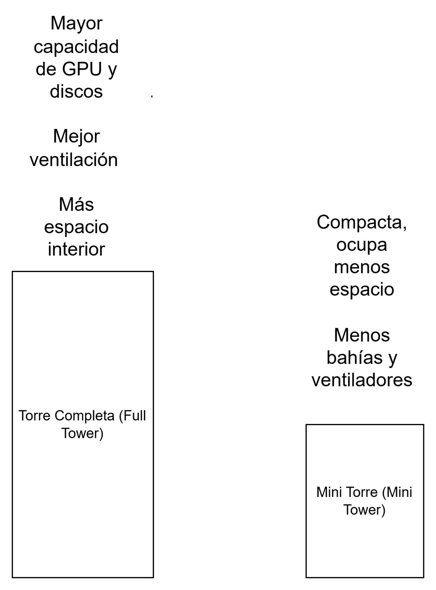

# Formatos de chasis: diagrama y análisis

**Formatos elegidos:** Torre Completa (Full Tower) y Mini Torre (Mini Tower)

## Diagrama

## Impacto del tamaño
- **Capacidad de componentes:**  La torre completa permite instalar más tarjetas gráficas, más discos duros y fuentes de alimentación grandes. En cambio, las mini torres tienen menos ranuras PCIe y menos espacio para almacenamiento interno.
- **Refrigeración:**  Las torres completas disponen de más espacio para ventiladores grandes, radiadores o sistemas de refrigeración líquida. Las mini torres suelen tener peor flujo de aire y se calientan antes si se montan componentes potentes.
- **Uso típico:**  
La torre completa se usa en equipos gaming, de diseño o servidores domésticos que requieren alto rendimiento y espacio para ampliaciones. La mini torre es más común en oficinas o para usuarios que buscan un PC pequeño, silencioso y con bajo consumo.