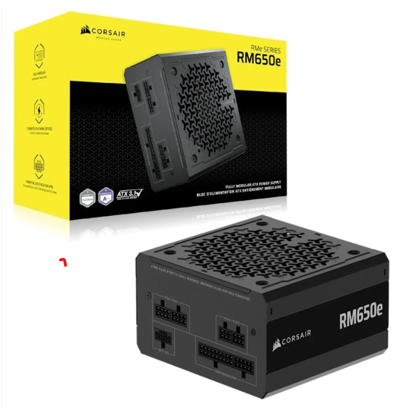
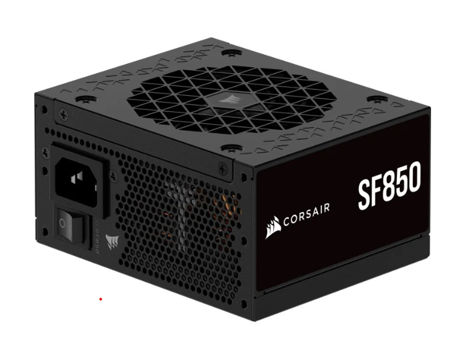
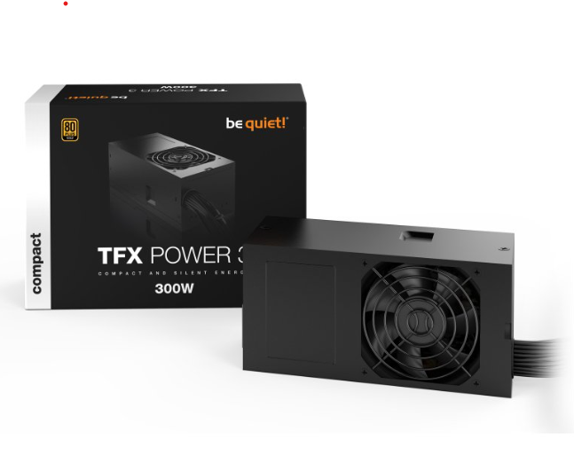
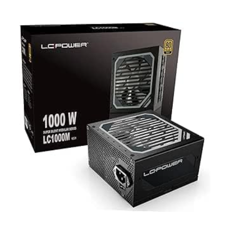
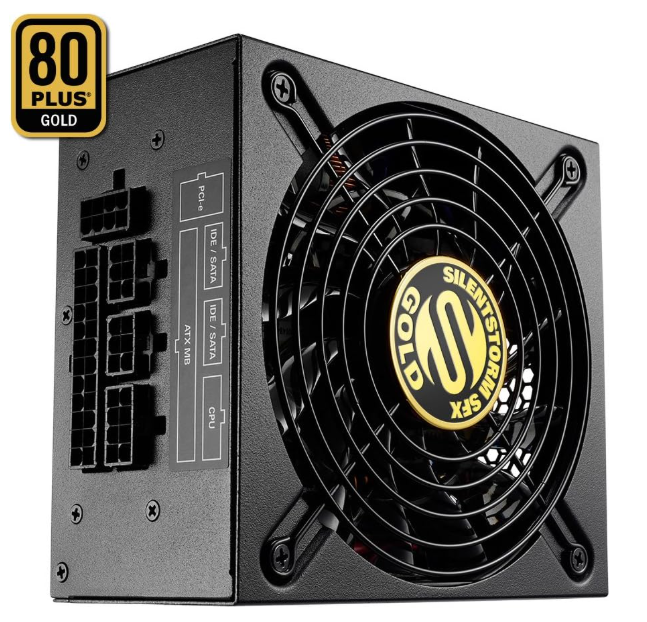
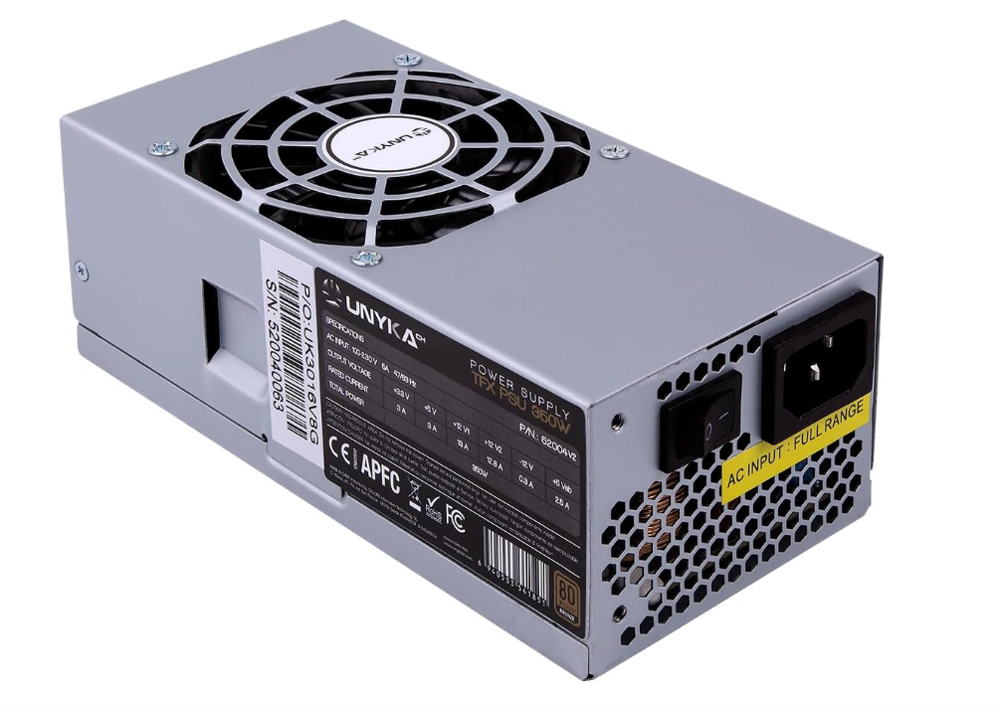
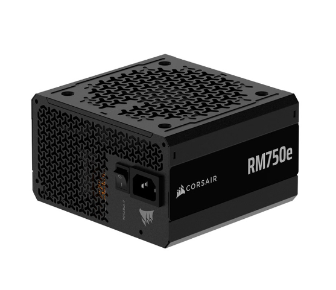
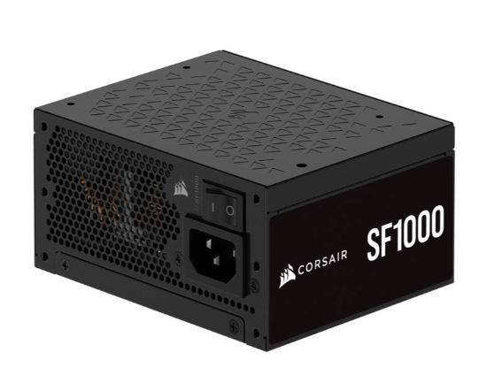
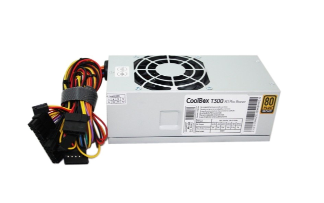

# Parte 1 — Actividades A y B (único archivo)

---
## Actividad A — Investigación de **Fuentes de Alimentación** (9 modelos)

**Instrucciones:**
1. Elige **3 tiendas online españolas/especializadas** (p. ej., PcComponentes, Amazon ES, LDLC ES).
2. En **cada tienda**, selecciona **un modelo ATX**, **uno SFX** y **uno TFX** (total 9).
3. Para cada modelo, recoge: **Marca/Modelo**, **Potencia (W)**, **Certificación 80 PLUS**, **Precio (€)**, **Modularidad**, **PFC (activo/pasivo)**, **Dimensiones (mm)**, **Enlace**.
4. Al final, incluye una **tabla resumen comparativa global**.

### Tienda 1: PcComponentes
| Tipo | Marca/Modelo | Potencia (W) | 80 PLUS | Precio (€) | Modularidad | PFC | Dimensiones (L×W×H mm) | Enlace |
|------|---------------|--------------|---------|-----------:|------------|-----|------------------------|--------|
| ATX | Corsair RMe Series RM650e | 650 | Gold | 84,99€ | Modular | Activo | 140 x 150 x 86 mm | https://www.pccomponentes.com/fuente-alimentacion-corsair-rme-series-rm650e-atx-31-pcle-51-650w-cybenetics-80-plus-gold-modular |
| SFX | Corsair SF850 | 850 | Platinum | 205,03€ | Modular | Activo | 100 x 63 x 125 mm |https://www.pccomponentes.com/fuente-alimentacion-corsair-sf850-850w-sfx-80-plus-platinum-modular |
| TFX | be quiet! TFX Power 3 300W | 300 | Gold | 63,78€ | No modular | Activo | 175 x 85 x 65 mm | https://www.pccomponentes.com/fuente-alimentacion-fuente-de-alimentacion-be-quiet-300w-80plus-gold-tfx-power-3-compacta-silenciosa-pcie |

**Notas/criterios de la tienda 1:** Buena disponibilidad de modelos ATX, SFX y TFX. Precios competitivos y fichas de producto muy completas. Web fácil de usar y envío rápido.
### Imágenes de la Tienda 1 (PcComponentes)

#### ATX  Corsair RM650e

#### SFX  Corsair SF850

#### TFX  be quiet! TFX Power 3 300W

### Tienda 2: Amazon
| Tipo | Marca/Modelo | Potencia (W) | 80 PLUS | Precio (€) | Modularidad | PFC | Dimensiones (L×W×H mm) | Enlace |
|------|---------------|--------------|---------|-----------:|------------|-----|------------------------|--------|
| 
 ATX | LC-Power LC1000M V3.0 | 1000 | Gold | 142,73€ | Modular | Activo | 160 x 150 x 86 mm | https://www.amazon.es/dp/B0CW5WR6FV |
| SFX | SHARKOON SilentStorm SFX Gold 500W | 500 | Gold | 116,46€ | Modular | Activo | 125 x 100 x 63 mm | https://www.amazon.es/dp/B00W4IVXFW |
  | TFX | UNYKAch TFX 350W | 350 | Bronze | 31,51€ | No modular | Activo | 150 x 80 x 40 mm | https://www.amazon.es/dp/B095PM5618 |
     

**Notas/criterios de la tienda 2:** Amplia variedad de modelos ATX, SFX y TFX. Precios actualizados y muchas opiniones de clientes. Envío rápido con Prime y fichas de producto detalladas.

### Imágenes de la Tienda 2 (Amazon)

#### ATX LC-Power LC1000M V3.0

#### SFX Sharkoon SilentStorm SFX Gold 500W

#### TFX UNYKAch TFX 350W Bronze

### Tienda 3: Coolmod
| Tipo | Marca/Modelo | Potencia (W) | 80 PLUS | Precio (€) | Modularidad | PFC | Dimensiones (L×W×H mm) | Enlace |
|------|---------------|--------------|---------|-----------:|------------|-----|------------------------|--------|
| ATX | Corsair RM750e 2025 | 750 | Gold | 119,95€ | Modular | Activo | 140 x 150 x 86 mm | https://www.coolmod.com/corsair-rm750e-2025-80-plus-gold-750w-atx-3-0-pcie-5-0-modular/ |
| SFX | Corsair SF1000 | 1000 | Platinum | 214,95€ | Modular | Activo | 125 x 100 x 63 mm | https://www.coolmod.com/corsair-sf1
| TFX | Coolbox TBZ300 | 300 | Bronze | 26,95€ | No modular | Activo | 175 x 85 x 65 mm | https://www.coolmod.com/coolbox-tbz300-tfx-80-plus-bronze-300w/ |

**Notas/criterios de la tienda 3:** Buenos precios en modelos premium, fichas detalladas, envíos rápidos y buena disponibilidad de gamas altas como SFX Platinum. Web muy clara y fácil de navegar.
### Imágenes de la Tienda 3 (Coolmod)

#### ATX Corsair RM750e 2025

#### SFX Corsair SF1000 Platinum7

#### TFX Coolbox TBZ300

#### Tabla **resumen comparativa** (global, 9 modelos)

| Tienda         | Tipo | Marca/Modelo                               | Potencia (W) | 80 PLUS   | Precio (€) | Modularidad | PFC    | Dimensiones (mm)    | Observaciones                                                                 |
|----------------|------|--------------------------------------------|-------------:|-----------|-----------:|-------------|--------|---------------------|------------------------------------------------------------------------------|
| PcComponentes  | ATX  | Corsair RM650e Series                      |          650 | Gold      |    84,99€  | Modular     | Activo | 140 x 150 x 86 mm   | Buena opción de gama media para la mayoría de PCs gaming.                    |
| PcComponentes  | SFX  | Corsair SF850                              |          850 | Platinum  |   205,03€  | Modular     | Activo | 100 x 63 x 125 mm   | Muy potente para cajas ITX, pero con precio alto.                            |
| PcComponentes  | TFX  | be quiet! TFX Power 3 300W                 |          300 | Gold      |    63,78€  | No modular  | Activo | 175 x 85 x 65 mm    | Pensada para PCs pequeños/ofimática, no para gráficas muy potentes.         |
| Amazon         | ATX  | LC-Power LC1000M V3.0                      |         1000 | Gold      |   142,73€  | Modular     | Activo | 160 x 150 x 86 mm   | Mucha potencia para equipos con gráfica de gama alta.                        |
| Amazon         | SFX  | SHARKOON SilentStorm SFX Gold 500W         |          500 | Gold      |   116,46€  | Modular     | Activo | 125 x 100 x 63 mm   | SFX equilibrada en potencia y precio para PCs compactos.                     |
| Amazon         | TFX  | UNYKAch TFX 350W                           |          350 | Bronze    |    31,51€  | No modular  | Activo | 150 x 80 x 40 mm    | Muy barata, suficiente para equipos básicos y ofimática.                     |
| Coolmod        | ATX  | Corsair RM750e 2025                        |          750 | Gold      |   119,95€  | Modular     | Activo | 160 x 150 x 86 mm   | Potencia holgada y buen equilibrio entre precio y prestaciones.              |
| Coolmod        | SFX  | Corsair SF1000 Platinum                    |         1000 | Platinum  |   214,95€  | Modular     | Activo | 100 x 63 x 125 mm   | Fuente SFX de gama alta para equipos muy exigentes y compactos.              |
| Coolmod        | TFX  | Coolbox TBZ300 TFX                         |          300 | Bronze    |    26,95€  | No modular  | Activo | 175 x 85 x 65 mm    | Opción económica para PCs sencillos en formato TFX.                          |

---

## Actividad B – **Refrigeración para la MISMA CPU** (Líquida vs Pasiva)

**Instrucciones:**
1. Elige una **CPU concreta** (ej.: Intel Core i9-13900, Ryzen 9 7950X…). Indícala abajo.
2. Selecciona **una refrigeración líquida AIO** y **una refrigeración por aire/pasiva**, **compatibles** con esa CPU. Incluye **URLs** oficiales o de tienda.
3. Compara **precio, eficiencia térmica (TDP soportado/temperaturas), ruido, dimensiones, compatibilidad de socket, mantenimiento y garantía**.
4. **Conclusión**: recomendaciones por perfil (**gamer**, **diseño/pro**, **usuario estándar**) y calidad-precio.

---

### **CPU elegida:** AMD Ryzen 5 7600 (AM5, 65 W TDP)

---

### **Modelos evaluados**

| Tipo            | Marca/Modelo                               | Precio (€) | TDP soportado / Rendimiento térmico                            | Ruido (dBA)           | Dimensiones (mm)              | Sockets compatibles          | Mantenimiento | Garantía | Enlace |
|-----------------|---------------------------------------------|-----------:|------------------------------------------------------------------|------------------------|-------------------------------|------------------------------|---------------|----------|--------|
| Líquida (AIO)   | **Corsair iCUE H100x RGB Elite 240 mm**     | 95€       | Hasta 200 W. CPU en carga fuerte 65-70 ºC                      | 25-37 dBA             | 240 × 120 × 27 (radiador)     | AM5, AM4, LGA1700, 1200…     | Cero (circuito cerrado) | 5 años   | https://www.corsair.com/ |
| Aire / Pasiva   | **be quiet! Pure Rock 2 Black**             | 45€       | Hasta 150 W. CPU 70-75 ºC en carga fuerte                      | 20-26 dBA (muy silencioso) | 155 × 121 × 87               | AM5, AM4, LGA1700, 1200…     | Limpiar polvo | 3 años   | https://www.bequiet.com/ |

---

### **Análisis y elección por perfil**

- **Gamer:**  
  La Corsair H100x mantiene temperaturas más bajas en sesiones largas, especialmente si se combina con una GPU potente. Permite sostener mejores frecuencias turbo.

- **Profesional (render, edición, VM):**  
  La líquida ofrece más margen térmico y estabilidad para cargas intensivas durante horas. Ideal si se busca el mejor rendimiento sostenido.

- **Usuario estándar/ofimática:**  
  El Pure Rock 2 es suficiente: silencioso, barato, fiable y sin complicaciones. Mantiene la CPU dentro de rangos ideales para uso diario.

---

### **Conclusión general**

- Para **máximo rendimiento, gaming y cargas intensas** → **Corsair H100x (AIO)**.  
- Para **relación calidad-precio, silencio y fiabilidad** → **be quiet! Pure Rock 2**.  
- En una CPU de 65 W como la Ryzen 7600, **ambas opciones funcionan bien**, pero el disipador por aire suele ser la opción más equilibrada salvo que busques rendimiento extremo.

---
