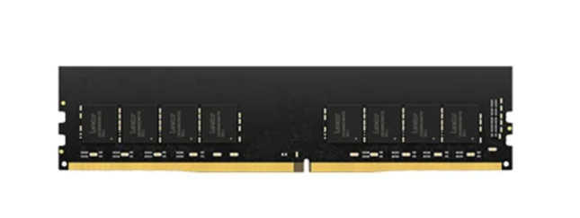
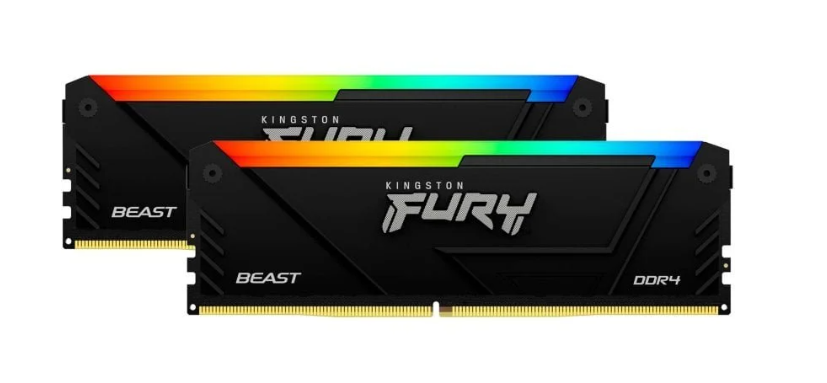
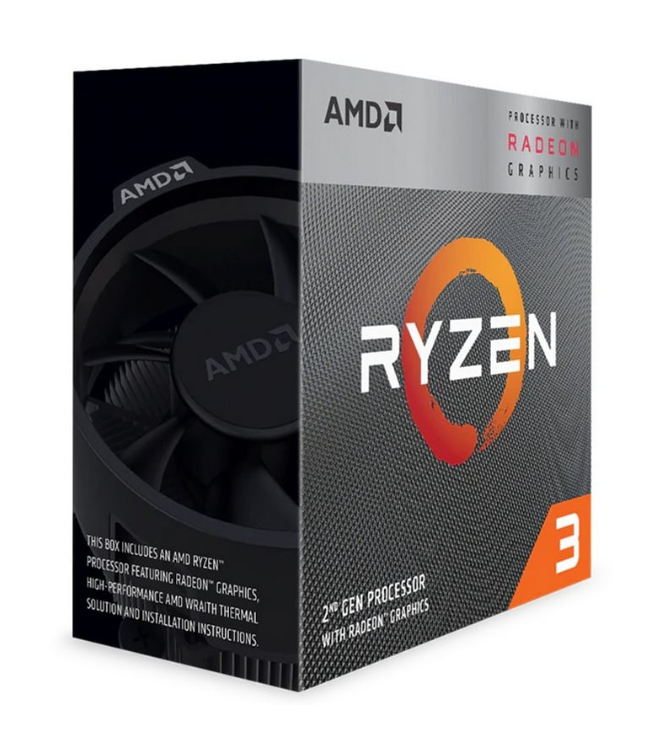
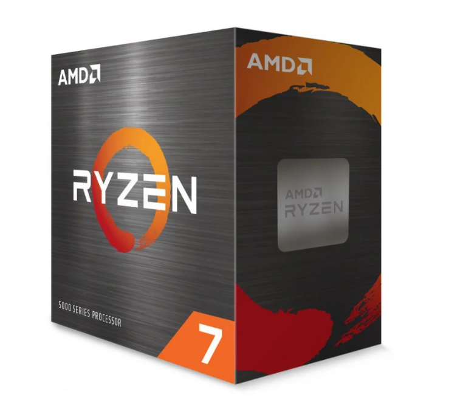

# 2 — Selección y comparación de componentes (único archivo)
  

---

### 1.1 Memoria RAM — PC de oficina
| Campo | Valor |
|---|---|
| **Marca y modelo** | Lexar LD4AU008G-B3200GSST |
| **Capacidad** | 8 GB |
| **Velocidad / Timings** | 3200 MHz, CL22 |
| **Tipo (DDR4/DDR5) y formato (DIMM/SO-DIMM)** | DDR4, DIMM 288 pines |
| **Precio (€)** | 45,87 € (precio visto en PcComponentes el 29/11/2025) |
| **URL** | https://www.pccomponentes.com/memoria-ram-modulo-de-memoria-lexar-ld4au# Parte008g-b3200gsst-8gb-ddr4-3200mhz-288-pin-dimm-cl22-pc |
| **Captura** |  |

| **Justificación** | He elegido este módulo porque para un PC de oficina 8 GB de DDR4 a 3200 MHz son suficientes para trabajar con programas de ofimática, el navegador y videollamadas sin que el equipo se ralentice. Es una memoria sencilla, sin luces ni extras gaming, con un precio razonable y basada en DDR4, que es compatible con muchos equipos actuales y permite montar un ordenador estable y económico. |

### 1.2 Memoria RAM — PC gaming
| Campo | Valor |
|---|---|
| **Marca y modelo** | Kingston FURY Beast RGB DDR4 3600MHz 16GB (2x8GB) CL17 |
| **Capacidad** | 16 GB (2x8GB Dual Channel) |
| **Velocidad / Timings / XMP-EXPO** | 3600 MHz, CL17, compatible con XMP |
| **Tipo (DDR4/DDR5)** | DDR4 |
| **Precio (€)** | 121,94 € (precio en PcComponentes a fecha de consulta) |
| **URL** | https://www.pccomponentes.com/kingston-fury-beast-rgb-ddr4-3600mhz-16gb-2x8gb-cl17 |
| **Captura** |  |
| **Justificación** | Esta memoria es adecuada para gaming porque ofrece 16 GB en Dual Channel, lo cual mejora el rendimiento en juegos frente a 8 GB. Los 3600 MHz y el perfil XMP permiten aprovechar la velocidad en placas compatibles, mejorando FPS y fluidez. Además, el RGB aporta estética típica de equipos gaming. |

### 1.3 Microprocesador — PC de oficina
| Campo | Valor |
|---|---|
| **Marca y modelo** | AMD Ryzen 3 3200G |
| **Núcleos / Hilos** | 4 núcleos / 4 hilos |
| **Frecuencias (base/boost)** | 3.6 GHz / hasta 4.0 GHz |
| **Gráficos integrados** | Radeon Vega 8 integrados |
| **TDP / Consumo** | 65W |
| **Precio (€)** | 52,90 € (precio visto en PcComponentes el 29/11/2025) |
| **Socket / Compatibilidad** | AM4 (compatible con placas A320, B450, X470, B550…) |
| **URL** | https://www.pccomponentes.com/amd-ryzen-3-3200g-36-ghz-box |
| **Captura** |  |
| **Justificación** | Elegido porque es un procesador económico y eficiente para tareas de oficina. Sus gráficos integrados permiten usar el PC sin tarjeta gráfica dedicada, reduciendo costes. Con 4 núcleos y hasta 4.0 GHz ofrece fluidez para Word, navegador, videollamadas y multitarea ligera con un consumo moderado. |

### 1.4 Microprocesador — PC gaming
| Campo | Valor |
|---|---|
| **Marca y modelo** | AMD Ryzen 7 5800X |
| **Núcleos / Hilos** | 8 núcleos / 16 hilos |
| **Frecuencias (base/boost)** | 3.8 GHz / hasta 4.7 GHz |
| **Caché** | 32 MB L3 |
| **TDP / Consumo** | 105W |
| **Precio (€)** | 169,90 € (precio visto en PcComponentes el 29/11/2025) |
| **Socket / Compatibilidad** | AM4 (ideal con placas B550 / X570 para gaming) |
| **URL** | https://www.pccomponentes.com/amd-ryzen-7-5800x-38ghz |
| **Captura** |  |
| **Justificación** | Elegido porque sus 8 núcleos y 16 hilos permiten obtener altos FPS en juegos modernos. La alta frecuencia boost reduce el cuello de botella con GPUs potentes y mejora la fluidez. Su relación rendimiento/precio lo hace ideal para un PC gaming actual y preparado para streaming o multitarea. |

---

## 2) Tabla comparativa — Tipos de RAM encontradas

Compara DDR4 vs DDR5 según las características más relevantes:

| Tipo RAM | Velocidad típica (MT/s) | Voltaje típico | Consumo / eficiencia | Precio por GB (estimado) | Compatibilidad (chipsets y sockets) | Observaciones destacadas |
|----------|--------------------------|----------------|-----------------------|---------------------------|-------------------------------------|---------------------------|
| DDR4     | 2133 – 3600 MT/s         | 1.2 V          | Buena eficiencia, tecnología madura | 5–6 € / GB                    | Intel 6ª–11ª Gen (LGA1151 / LGA1200), AMD AM4 (Ryzen 1000–5000) | Excelente relación calidad-precio, muy compatible, suficiente para oficina y gaming estándar. Latencias más bajas. |
| DDR5     | 4800 – 6400+ MT/s        | 1.1 V          | Más eficiente por bit, mejor gestión energética | 10–15 € / GB                  | Intel 12ª–14ª Gen (LGA1700 DDR5), AMD AM5 (Ryzen 7000+)        | Más rápida y preparada para el futuro, pero más cara y solo compatible con plataformas nuevas. Mayores capacidades por módulo. |

> Nota: Tanto el Ryzen 3 3200G como el Ryzen 7 5800X que seleccionaste solo son compatibles con **DDR4**, ya que pertenecen a la plataforma AM4 de AMD.

###  Resumen

La memoria **DDR4** sigue siendo la mejor opción si buscas **rendimiento sólido a buen precio**, especialmente en proyectos con presupuesto ajustado o reutilización de componentes. Es ideal para equipos de oficina y gaming estándar.

Por otro lado, **DDR5** representa el futuro en cuanto a rendimiento bruto: mayor velocidad, mejor eficiencia energética y capacidades más altas. Está orientada a **equipos de nueva generación**, especialmente para **gaming extremo, edición de vídeo, diseño, IA o multitarea intensa**. Requiere una **placa base y CPU compatibles**.

---

---

## 3) Investigación — DDR5

Responde con apoyo de fuentes técnicas recientes y documentación especializada.

1. **Ventajas frente a DDR4:**  
   - Mayor velocidad de transferencia (de 4800 a 8400 MT/s en modelos actuales y futuros).  
   - Menor voltaje por defecto (1.1V frente a 1.2V), lo que implica mayor eficiencia energética.  
   - Incorpora **PMIC on-module** (gestión de energía integrada en cada módulo) y **ECC on-die**, mejorando estabilidad y control de errores.  
   - Mayor densidad: se pueden fabricar módulos de 24GB, 32GB o más, ideales para tareas exigentes.  
   - Mejores perfiles de overclocking con soporte de **XMP 3.0 (Intel)** y **EXPO (AMD)**.

2. **Usos donde se aprecia la diferencia:**  
   - Aplicaciones de **IA, renderizado 3D, edición de vídeo 4K, producción musical profesional**, o trabajo con bases de datos grandes.  
   - Juegos muy dependientes de CPU (CPU-bound), como simuladores o estrategia en tiempo real, especialmente en resoluciones bajas con altas tasas de FPS.  
   - Equipos multitarea intensiva, donde se ejecutan varias aplicaciones pesadas a la vez.

3. **Ejemplo ventajoso:**  
   - Un **estudio de arquitectura** con un equipo de diseño que renderiza planos 3D en tiempo real usando Unreal Engine y Blender, obtiene tiempos de carga y previsualización mucho más rápidos con DDR5 frente a DDR4.  
   - Un **creador de contenido** que edita vídeos 4K en DaVinci Resolve y ejecuta IA para efectos visuales gana fluidez gracias al ancho de banda superior de la DDR5.

> Aunque DDR5 es más cara, en entornos profesionales o entusiastas **marca una diferencia clara** frente a DDR4 en productividad, velocidad y estabilidad.

---

## 4) Fuentes
- [Crucial - Beneficios de DDR5 sobre DDR4] — https://www.crucial.com/catalog/memory/ddr5
- [Kingston - ¿Qué es DDR5?] — https://www.kingston.com/es/search?q=ddr5
- [Intel - Tipos de memoria compatibles por procesador] — https://www.intel.com/content/www/us/en/search.html#q=ddr5
- [Corsair - Memoria DDR5 explicada] —  https://www.corsair.com/es/es/search?q=ddr5
- [TechSpot - Comparativa DDR5 vs DDR4] — https://www.techspot.com/search/?cx=partner-pub-7395890353660701%3Aj5claj-6kfy&cof=FORID%3A11&ie=UTF-8&q=ddr5#gsc.tab=0&gsc.q=ddr5&gsc.page=1

---

