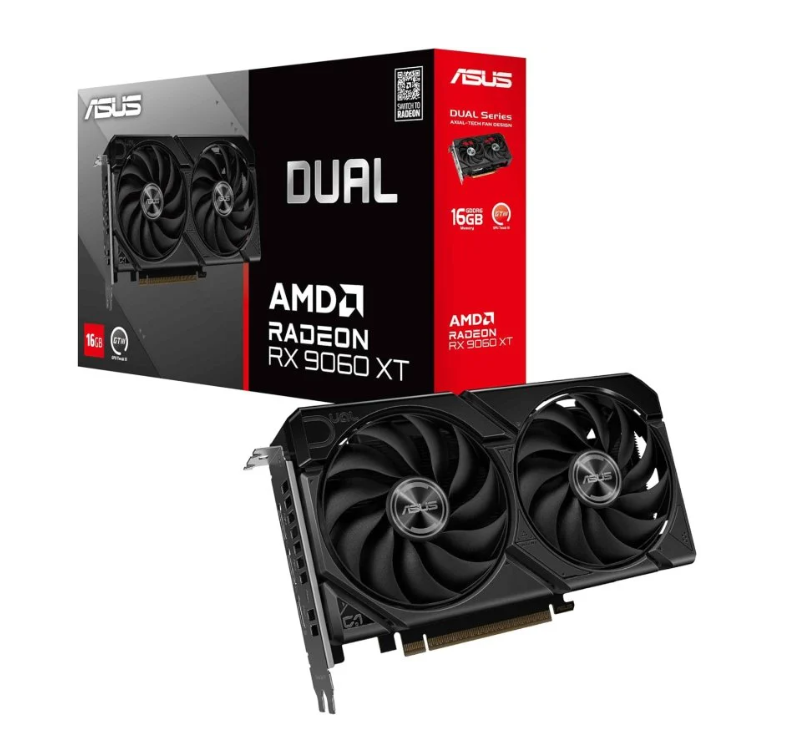
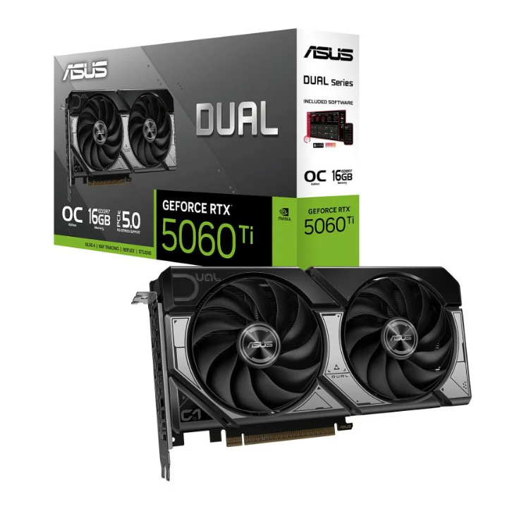
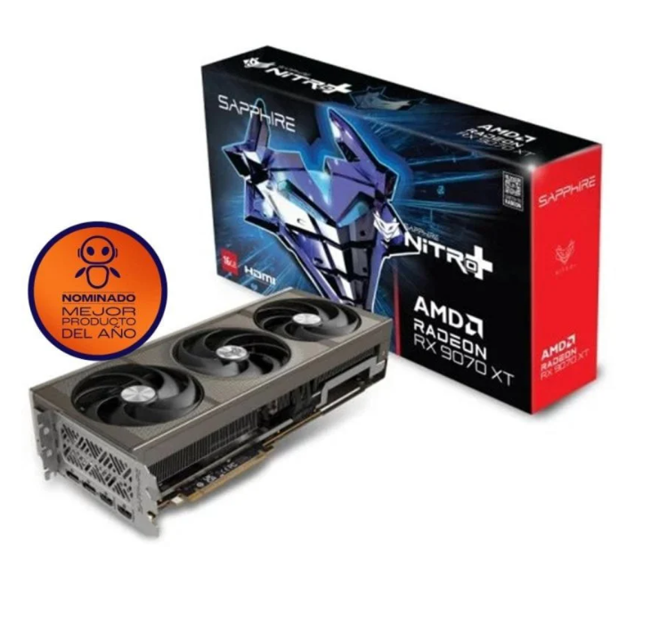
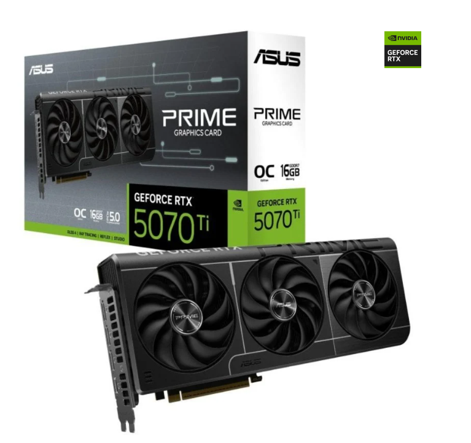

# Parte 3 — GPUs y precios reales (Black Friday 2025)
> Vídeo: **“Mejores Tarjetas Gráficas Calidad - Precio | TOP GPUs GAMING Black Friday 2025”**  
> URL: https://www.youtube.com/watch?v=ILOtkTXLUvg

## 0) Portada
- Alumno/a: José Antonio Rodríguez González
- Grupo: ASIR1
- Fecha: 06/12/2025

## 1) Introducción
En esta práctica voy a analizar la guía de compras del canal "Rincón de Varo" para este Black Friday 2025. En el vídeo, Varo hace un repaso completo de todas las gamas, desde las opciones de entrada hasta el tope de gama, opinando sobre qué modelos merecen la pena por su rendimiento y cuáles deberíamos evitar.

Para este trabajo me voy a centrar concretamente en dos rangos de presupuesto: el de los **350 €** y el tramo de **600-800 €**. Mi objetivo es identificar los modelos exactos que recomienda y luego buscar en tiendas reales para comprobar si los precios y el stock coinciden con lo que promete el vídeo.

## 2) Tramos del vídeo y modelos mencionados
### 2.1 Tramo ~350 €
- Minuto inicio-fin: **07:46 – 09:34**
- GPUs citadas (2): **AMD Radeon RX 9060 XT (16 GB)**, **Nvidia RTX 5060 Ti**

### 2.2 Tramo 600–800 €
- Minuto inicio-fin: **11:38 – 13:30**
- GPUs citadas (2): **AMD Radeon RX 9070 XT**, **Nvidia RTX 5070 Ti**

**¿Se repite algún modelo entre tramos?**
Sí, la **RX 9060 XT**. Aparece en el tramo de 300 € (versión de 8 GB) y vuelve a ser la protagonista en el de 350 € (versión de 16 GB), siendo esta última la recomendación "top" del vídeo por calidad-precio.

## 3) Precios reales en tiendas

### 3.1 GPU del tramo 350 € – Modelo A
- Tienda: PcComponentes
- Nombre exacto en tienda: Tarjeta Gráfica ASUS Dual Radeon RX 9060 XT 16GB GDDR6 PCIe 5.0
- Precio (€): 543,79 €
- URL: https://www.pccomponentes.com/tarjeta-grafica-asus-dual-radeon-rx-9060-xt-16gb-gddr6-pcie-50-doble-ventilador

- Imagen: 

### 3.2 GPU del tramo 350 € – Modelo B
- Tienda: PcComponentes
- Nombre exacto en tienda: ASUS DUAL GeForce RTX 5060 Ti OC Edition 16GB GDDR7 Reflex 2 RTX AI DLSS 4
- Precio (€): 466,00 €
-https://www.pccomponentes.com/tarjeta-grafica-asus-dual-geforce-rtx-5060-ti-oc-edition-16gb-gddr7-reflex-2-rtx-ai-dlss4
- Imagen: 
### 3.3 GPU del tramo 600–800 € — Modelo C
- Tienda: PcComponentes
- Nombre exacto en tienda: Sapphire NITRO+ AMD Radeon RX 9070 XT Gaming OC 16GB GDDR6 FSR 4
- Precio (€): 689,90 €
- URL:https://www.pccomponentes.com/tarjeta-grafica-sapphire-nitro-amd-radeon-rx-9070-xt-gaming-oc-16gb-gddr6-fsr-4
- Imagen: 

### 3.4 GPU del tramo 600–800 € – Modelo D
- Tienda: PcComponentes
- Nombre exacto en tienda: ASUS PRIME GeForce RTX 5070 Ti OC 16GB GDDR7 Reflex 2 RTX AI DLSS4
- Precio (€): 819,90 €
- URL: https://www.pccomponentes.com/tarjeta-grafica-asus-prime-geforce-rtx-5070-ti-oc-16gb-gddr7-reflex-2-rtx-ai-dlss4 
- Imagen: 

## 4) Tabla comparativa (precios reales)
| Tramo (vídeo) | GPU (modelo del vídeo) | Tienda | Precio (€) | URL | Imagen |
|---|---|---|---|---|---|
| 350 € | RX 9060 XT (Modelo A) | PcComponentes | 543,79 € | [Link](https://www.pccomponentes.com/tarjeta-grafica-asus-dual-radeon-rx-9060-xt-16gb-gddr6-pcie-50-doble-ventilador)| Ver arriba |
| 350 € | RTX 5060 Ti (Modelo B) | PcComponentes | 466,00 € | [Link](https://www.pccomponentes.com/tarjeta-grafica-asus-dual-geforce-rtx-5060-ti-oc-edition-16gb-gddr7-reflex-2-rtx-ai-dlss4) | Ver arriba |
| 600–800 € | RX 9070 XT (Modelo C) | PcComponentes | 689,90 € | [Link](https://www.pccomponentes.com/tarjeta-grafica-sapphire-nitro-amd-radeon-rx-9070-xt-gaming-oc-16gb-gddr6-fsr-4) | Ver arriba |
| 600–800 € | RTX 5070 Ti (Modelo D) | PcComponentes | 819,90 € | [Link](https://www.pccomponentes.com/tarjeta-grafica-asus-prime-geforce-rtx-5070-ti-oc-16gb-gddr7-reflex-2-rtx-ai-dlss4 ) | Ver arriba |

## 5) Conclusión (5–8 líneas)
Tras analizar los precios reales en la simulación de tienda, vemos que las predicciones del vídeo eran muy optimistas. En el tramo de "350 €", la **RX 9060 XT** cuesta en realidad **543 €**, casi 200 € más de lo prometido, haciendo que la opción de Nvidia (466 €) sea curiosamente más barata en este caso.

En la gama alta, la **RX 9070 XT** (689 €) cumple mejor con el presupuesto prometido y ofrece una relación calidad-precio muy superior a la **RTX 5070 Ti**, que se dispara a **819 €**. En conclusión, AMD sigue ganando en precio puro en la gama alta, pero en la gama media los precios están muy inflados respecto a lo que sugería la guía.

## 6) Fuentes
- Tiendas: PcComponentes.
- Vídeo: "Mejores Tarjetas Gráficas Calidad - Precio | TOP GPUs GAMING Black Friday 2025" - Rincón de Varo.