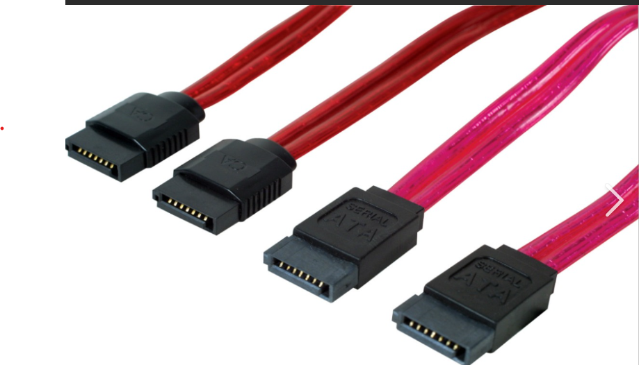

# Conector SATA de Datos

## Descripción general
El conector **SATA de datos** (Serial ATA) reemplazó al antiguo conector **IDE/PATA**.  
Se utiliza para transferir información entre la **placa base** y los **discos duros, SSD o unidades ópticas**.

## Función principal
Permite la **comunicación de datos** entre el dispositivo de almacenamiento y el sistema.  
Su diseño fino y con pestaña en forma de “L” evita errores al conectar.

## Imagen de referencia

**Figura 7.** Conector SATA de datos de 7 pines, utilizado para la conexión de discos duros y SSD.  
Fuente: Imagen técnica de referencia (búsqueda en Google Imágenes: “conector SATA datos”).

## Datos técnicos
- **Núm**
