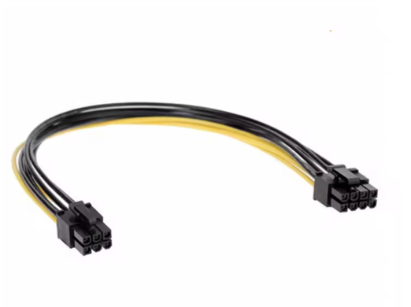

# Conector PCIe de 6/8 pines (alimentación GPU)

## Descripción general
El conector PCI Express (PCIe) de 6 u 8 pines se utiliza para proporcionar energía adicional a las tarjetas gráficas (GPU).  
Las tarjetas más potentes requieren más energía de la que puede ofrecer la ranura PCIe de la placa base, por lo que se conectan directamente a la fuente de alimentación (PSU).

## Función principal
Su función es suministrar energía de +12V a las tarjetas gráficas.  
Existen versiones de 6 pines (hasta 75 W) y de 8 pines (hasta 150 W). En algunos casos se usan conectores combinados 6+2 para ofrecer compatibilidad con ambos formatos.

## Imagen de referencia

> **Figura 5.** Conector PCIe de 8 pines (6+2), utilizado para alimentar tarjetas gráficas de alto rendimiento.  
> Fuente: Imagen técnica de referencia (búsqueda en Google Imágenes: “PCIe 8 pin power connector 6+2”).

## Datos técnicos
- **Voltaje:** +12 V  
- **Número de pines:** 6 o 8 (según modelo)  
- **Potencia máxima:** 75 W (6 pines) / 150 W (8 pines)  
- **Tipo de conector:** Alimentación GPU (PCI Express)  
- **Compatibilidad:** Tarjetas gráficas PCIe modernas  
- **Ubicación:** Cable de la fuente de alimentación a la GPU

## Observaciones
Los conectores PCIe de 6+2 pines permiten mayor flexibilidad, ya que pueden usarse en tarjetas que requieran 6 o 8 pines.  
En las GPU actuales, pueden combinarse varios conectores (por ejemplo, 2×8 pines) para alcanzar potencias superiores.
