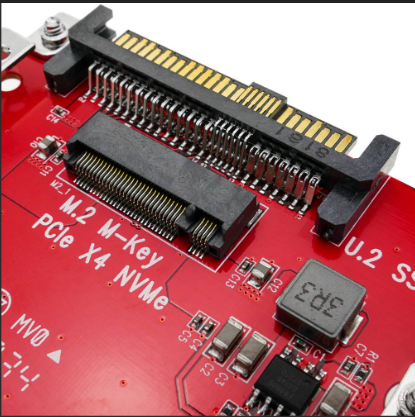

# Conector M.2 / NVMe

## Descripción general
El conector **M.2** (antes conocido como NGFF, *Next Generation Form Factor*) se utiliza para conectar unidades de almacenamiento **SSD** directamente a la **placa base**, eliminando cables de datos y alimentación.

## Función principal
Permite una **transferencia de datos ultrarrápida** mediante el protocolo **NVMe (Non-Volatile Memory Express)**, utilizando las líneas **PCIe** o **SATA**, según el tipo de SSD instalado.

## Imagen de referencia

**Figura 8.** Conector M.2 (NVMe) para unidades SSD de alto rendimiento, instalado directamente sobre la placa base.  
Fuente: Imagen técnica de referencia (búsqueda en Google Imágenes: “conector M.2 NVMe SSD”).

## Datos técnicos
- **Número de contactos:** 67 pines  
- **Formatos comunes:** 2242, 2260, 2280, 22110  
- **Protocolos compatibles:** NVMe (PCIe), SATA  
- **Velocidad máxima:** hasta 7.000 MB/s (PCIe 4.0 x4)  
- **Compatibilidad:** SSD M.2 NVMe y M.2 SATA  

## Observaciones
Los conectores **M.2 NVMe** reemplazan progresivamente a los puertos SATA tradicionales.  
Ofrecen mayor rendimiento y menor consumo energético, ideales para equipos portátiles y de alto rendimiento.
